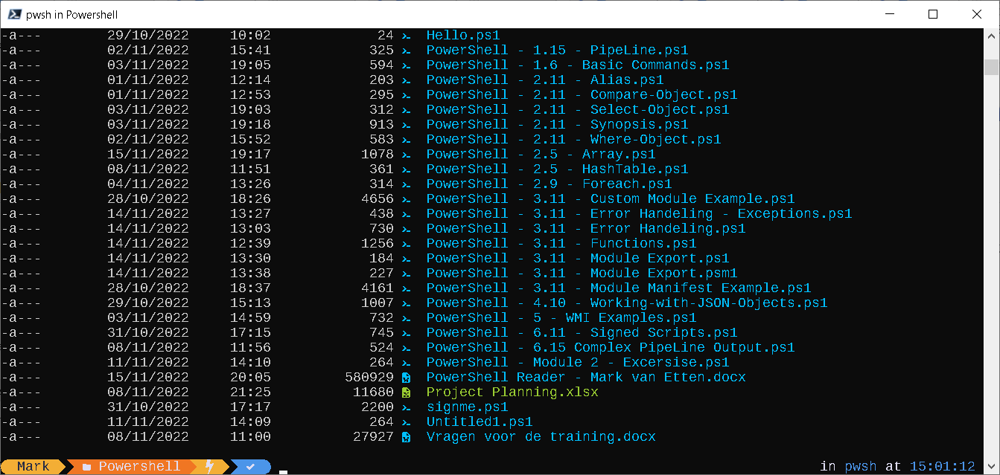

# Oh-My-Posh-AutoInstaller

# How to install?

1) Run PowerShell 7.x as Administrator
2) Run the following command:

Set-ExecutionPolicy Bypass -Scope Process -Force; Invoke-Expression ((New-Object System.Net.WebClient).DownloadString('https://raw.githubusercontent.com/mvanetten/Oh-My-Posh-AutoInstaller/main/installer.ps1'))

3) Close and Open the PowerShell Window
4) Right Click on Titlebar and select Properties.
5) Go to Tab -> Fonts and select Cousine NFM
