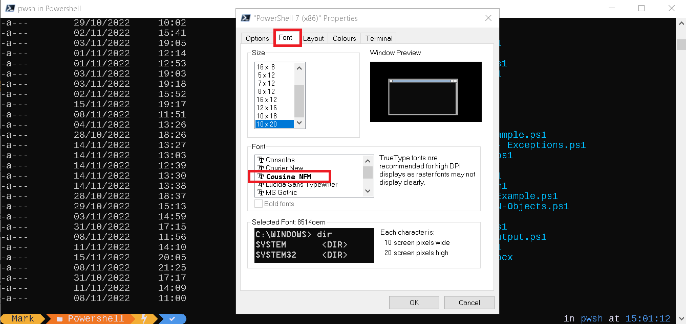

# Oh-My-Posh-AutoInstaller

Oh My Posh enables you to use the full color set of your terminal by using colors to define and render the prompt.


# How to install? (Windows 10)

1) Run [PowerShell 7.x](https://learn.microsoft.com/nl-nl/powershell/scripting/install/installing-powershell-on-windows?view=powershell-7.3#msi "Microsoft Site") as Administrator (! important step !)
2) Run the following command:
```Powershell
Set-ExecutionPolicy Bypass -Scope Process -Force; Invoke-Expression ((New-Object System.Net.WebClient).DownloadString('https://raw.githubusercontent.com/mvanetten/Oh-My-Posh-AutoInstaller/main/installer.ps1'))
```
3) Restart computer
4) Run PowerShell 7.x as Administrator
5) Right Click on Titlebar and select Properties.
6) Go to Tab -> Fonts and select Cousine NFM



